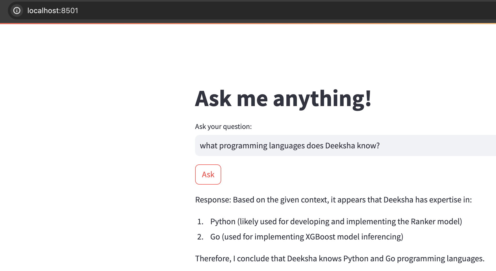

# Objective
Develop a Retrieval-Augmented Generation (RAG) based AI system capable of answering questions about yourself.
I have my resume under the `data/` folder(you can keep any number of pdf files under `data/` maybe personal or someting related to work). 
The objective is to create a simple RAG agent that will answer questions based on data and LLM. 
Short steps are - 
- load the personal data and split it into chunks(pages)
- for each chunk 
    - get embeddings from a LLM model
    - index in a vector db
- user query via streamlit 
    - retrieve context i.e relevant entry from vector db given the query 
    - use context + query to create a prompt
    - pass the prompt to a LLM model


## Installation

1. Clone the repository.
2. Create a conda environment and activate it.
3. Install the required dependencies by running the following command:

   ```shell
   pip install -r requirements.txt
4. install [ollama](https://ollama.com/) to locally run LLM models
5. keep the data under `data/` folder
6. to invoke llm models, we need to first downlaod the model and then run ollama locally -
    ```cmd
    ollama pull llama3
    ollama serve
7. run the following command - 
    ```cmd
    streamlit run app.py

## Some details about code - 
- initialize the RAGSystem class
    - load the data into a format
        - load the pdfs as list of pages    
        - pages are further split into chunks; for better representation
            - change the chunk_size, chunk_overlap according to choice
            - other splitters are available by langchain [here](https://python.langchain.com/v0.1/docs/modules/data_connection/document_transformers/)
        - set a unique id for each chunk
    - initialize a vectordb where will store chunks and their respective embeddings
        - we use chromadb
        - embeddings are from llama3 model; 
    - add chunks to vector db
- user inputs a query
    - calls `answer_query`
    - retrevies context from vector db based on query
        - [improvement] instead of just using whatever entries are sent by vectordb; we can use a reranker to rerank the entries wrt our query for better context
        - langchain provides lot of [retrievers](https://python.langchain.com/v0.1/docs/integrations/retrievers/bm25/)
    - create a prompt using context + query 
    - invoke LLM(llama3) with prompt
    - format and send back response

## possible methods of evaluating the quality [to do]
- we can have LLM judge our response given a evaluation prompt 
- 
    ```cmd
    eval_prompt = 
    """
        Expected Response: {expected_response}
        Actual Response: {actual_response}
        ---
        On a scale of 1 to 5, with 5 being identical, how well does the actual response match the expected response? 
    """
## to maintain context of chats [to do]


## example of a query about personal data

